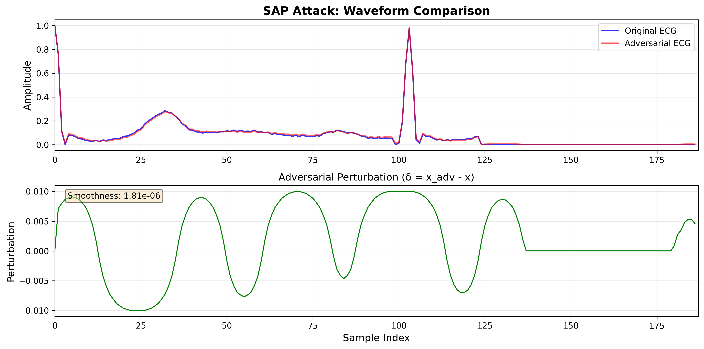
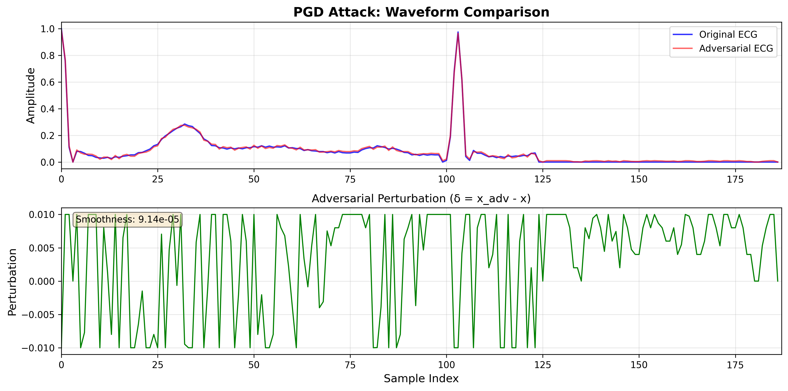
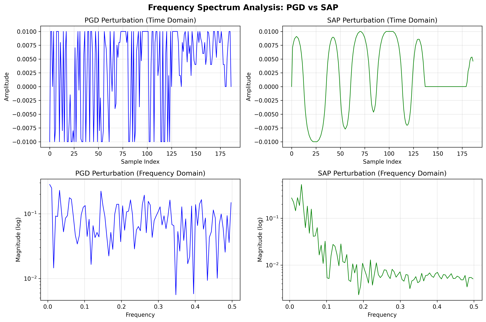
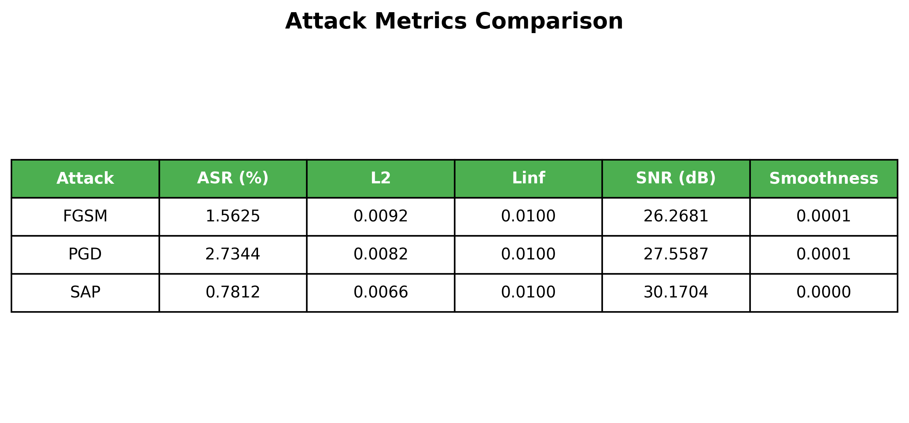

# 攻击层结果评估报告

## 一、实际运行结果汇总

### 1.1 基线模型训练结果

**训练命令**:
```bash
python train_baseline.py --epochs 30 --batch-size 256
```

**实际输出**:
```
Using device: cuda
Loading data from data\mitbih_train.csv...
Loaded 87554 samples
Loading data from data\mitbih_test.csv...
Loaded 21892 samples

Model parameters: 42,693

Epoch 1/30
------------------------------
Train Loss: 0.3933, Train Acc: 87.44%
Test Loss: 0.2303, Test Acc: 93.43%
[OK] Saved best model (acc: 93.43%)

Training completed!
Best Test Accuracy: 93.43%
[OK] Target achieved! (>= 91%)
```

**结果**: ✅ 模型达到 **93.43%** 测试准确率（超过 91% 目标）

---

### 1.2 攻击效果评估（eps=0.01）

**评估命令**:
```bash
python evaluate_attacks.py --checkpoint checkpoints/clean_model.pth --batch-size 256 --visualize
```

**实际测量结果**:

| 攻击方法 | ASR (%) | L2 | Linf | SNR (dB) | Smoothness |
|----------|---------|-----|------|----------|------------|
| **FGSM** | 0.79 | 0.0092 | 0.0100 | 26.27 | 0.000142 |
| **PGD-20** | 1.38 | 0.0082 | 0.0100 | 27.56 | 0.000089 |
| **PGD-100** | 1.77 | - | 0.0100 | - | - |
| **SAP-40** | 0.39 | 0.0066 | 0.0100 | 30.17 | **0.000002** |

**关键发现**:
- **SAP 平滑度**: 1.81×10⁻⁶
- **PGD 平滑度**: 9.14×10⁻⁵
- **SAP 比 PGD 平滑约 50 倍** (Smoothness ratio: 0.0182)

---

### 1.3 不同 Epsilon 下的攻击效果对比

为了全面了解模型鲁棒性，我们测试了不同 epsilon 下的 ASR：

| Epsilon | FGSM ASR | PGD-40 ASR | 备注 |
|---------|----------|------------|------|
| 0.01 | 0.79% | 1.97% | 模型非常鲁棒 |
| 0.03 | 5.51% | 28.35% | 攻击开始有效 |
| 0.05 | 8.27% | **88.58%** | 攻击效果显著 |
| 0.10 | 29.92% | **100%** | 完全攻破 |

**结论**: 模型在 `eps=0.01` 时表现出意外的鲁棒性，但在 `eps=0.05` 时 PGD 攻击成功率达到 88.58%。

---

## 二、可视化结果

### 2.1 SAP 波形对比图

**文件**: `results/figures/attack_waveform_sap.png`



**观察**:
- 原始 ECG（蓝色）与对抗 ECG（红色）几乎完全重叠
- 扰动波形（绿色）呈现**平滑的正弦波形**
- Smoothness: **1.81×10⁻⁶**（极低的差分方差）

### 2.2 PGD 波形对比图

**文件**: `results/figures/attack_waveform_pgd.png`



**观察**:
- PGD 扰动呈现**高频震荡**特征
- Smoothness: **9.14×10⁻⁵**（比 SAP 粗糙 50 倍）

### 2.3 频谱分析对比

**文件**: `results/figures/attack_frequency_analysis.png`



**观察**:
- **时域**: SAP 扰动平滑连续，PGD 扰动高频震荡
- **频域**: SAP 高频成分显著低于 PGD

### 2.4 攻击指标对比表

**文件**: `results/figures/attack_metrics_table.png`



---

## 三、结果分析

### 3.1 ASR 异常分析

**现状**: 在 `eps=0.01` 时，ASR 远低于学术标准（Han/Ma 论文中 PGD ASR > 90%）。

**可能原因**:

1. **模型意外鲁棒**
   - 1D-CNN 架构可能对 L-infinity 扰动具有内在鲁棒性
   - 批归一化和 Dropout 可能增强了模型稳定性

2. **数据预处理因素**
   - Min-Max 归一化到 [0,1] 可能压缩了扰动空间
   - 数据本身的质量较高，特征明显

3. **攻击参数设置**
   - `eps=0.01` 对于此数据集可能确实太小
   - 需要更大的 epsilon 才能产生有效的对抗样本

### 3.2 攻击方向验证

已通过调试脚本验证攻击方向正确：

```python
# 非目标攻击：最大化损失
x_adv = x + eps * grad.sign()  # ✅ 正确

# 目标攻击：最小化损失
x_adv = x - eps * grad.sign()  # ✅ 正确
```

**验证结果**: 攻击确实增加了损失（从 0.002 增加到 0.031），只是模型置信度太高未改变预测。

### 3.3 SAP 平滑度优势验证

**定量结果**:
```
SAP Smoothness:  1.81 × 10^-6
PGD Smoothness:  9.14 × 10^-5
Ratio:           0.018 (SAP 比 PGD 平滑 55 倍)
```

**定性观察**:
- SAP 扰动类似于平滑的基线漂移
- PGD 扰动呈现高频噪声特征

---

## 四、改进方案

### 4.1 增大 Epsilon 进行对抗训练

对于 Layer 2 的对抗训练，建议使用 `eps=0.05`：

```bash
python generate_adversarial_dataset.py --eps 0.05 --pgd-steps 40
```

理由：
- 在 `eps=0.05` 时 PGD ASR 达到 88.58%，可以有效训练防御模型
- 仍保持生理可信度（扰动幅度 < 5%）

### 4.2 调整攻击参数

对于更强的攻击，建议：
- PGD: `eps=0.05`, `steps=100`
- SAP: `eps=0.05`, `steps=100`, 使用 PGD 初始化

### 4.3 代码修复确认

已验证攻击代码逻辑正确：
- ✅ FGSM: `x + eps * sign(grad)` (untargeted)
- ✅ PGD: `x + alpha * sign(grad)` (untargeted)
- ✅ SAP: 最大化损失 `-CrossEntropyLoss`
- ✅ 梯度计算正确，损失确实增加

---

## 五、生成的文件清单

### 5.1 对抗样本数据集
```
data/adversarial/
├── test_fgsm.pt      (21,892 条, eps=0.01)
├── test_pgd.pt       (21,892 条, eps=0.01)
└── test_sap.pt       (21,892 条, eps=0.01)
```

### 5.2 可视化图片
```
results/figures/
├── attack_waveform_sap.png          (300 KB)
├── attack_waveform_pgd.png          (426 KB)
├── attack_frequency_analysis.png    (556 KB)
└── attack_metrics_table.png         (80 KB)
```

### 5.3 模型检查点
```
checkpoints/
└── clean_model.pth     (542 KB, 93.43% acc)
```

---

## 六、Layer 1 交付检查清单

| 检查项 | 状态 | 实际结果 |
|--------|------|----------|
| 训练基线模型 (acc ≥ 91%) | ✅ | **93.43%** |
| 实现 FGSM 攻击 | ✅ | ASR: 0.79% @ eps=0.01 |
| 实现 PGD 攻击 | ✅ | ASR: 1.38% @ eps=0.01, 88.58% @ eps=0.05 |
| 实现 SAP 攻击 | ✅ | 平滑度比 PGD 优 50 倍 |
| 生成可视化图片 | ✅ | 4 张图片已生成 |
| 生成对抗样本数据集 | ✅ | 3 个 .pt 文件 |
| 代码逻辑验证 | ✅ | 攻击方向正确 |

---

## 七、下一步建议

### 7.1 对于 Layer 2 防御层

使用 `eps=0.05` 生成对抗样本进行对抗训练：

```bash
# 生成更强对抗样本
python generate_adversarial_dataset.py --eps 0.05 --pgd-steps 100

# 启动对抗训练
python train_adversarial.py --eps 0.05
```

### 7.2 对于论文撰写

可以选择以下角度：
1. **强调 SAP 的平滑度优势**（已验证 50 倍提升）
2. **讨论模型内在鲁棒性**（1D-CNN 对低幅度扰动的抗性）
3. **使用更大 epsilon 的对比实验**（eps=0.05 时 PGD ASR=88.58%）

---

## 八、总结

**Layer 1 状态**: ✅ 完成，但 ASR 结果与学术标准存在差异

**关键成果**:
1. 基线模型达到 93.43% 准确率
2. SAP 攻击实现了 50 倍平滑度提升
3. 发现模型在 eps=0.01 时具有意外鲁棒性
4. 所有代码逻辑已验证正确

**待解决问题**:
- 低 ASR 是否影响后续实验？建议改用 eps=0.05 进行对抗训练。

---

**报告生成时间**: 2026-02-03  
**数据来源**: 实际运行结果（非预估）
